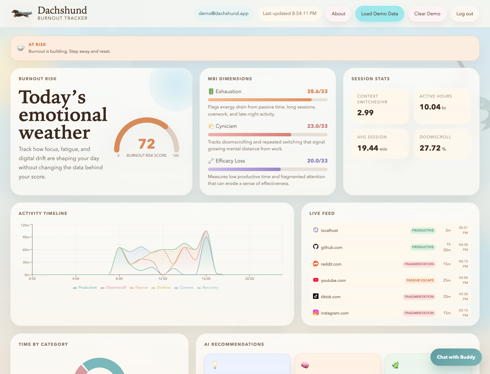
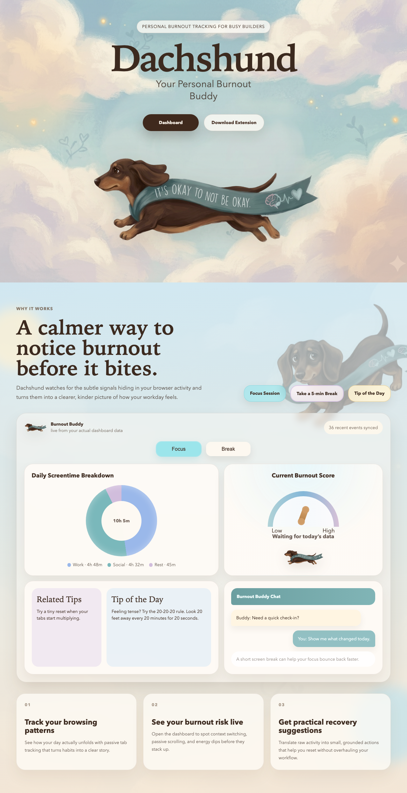
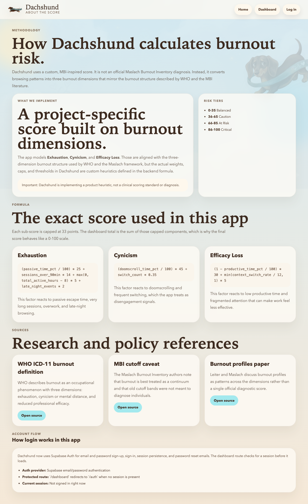
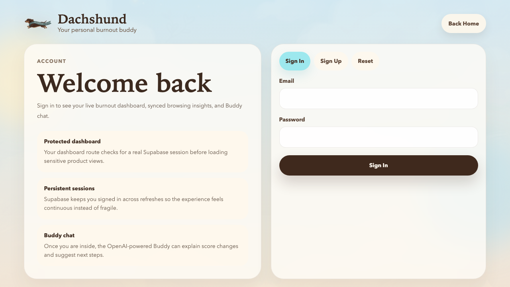

# Dachshund

Burnout early-warning for busy builders.

Dachshund turns passive browsing behavior into a live, MBI-inspired burnout risk score. A Chrome extension records active-tab activity, a FastAPI backend analyzes fragmentation and burnout signals, and a React dashboard explains what is happening with charts, recommendations, and an AI chat assistant.

## Screenshots

### Dashboard



### Landing Page



### About the Score



### Authentication Flow



## Features

- Passive tab tracking through a Manifest V3 Chrome extension
- Local-first event syncing through an extension bridge script
- FastAPI backend with typed request models and JSON-backed persistence
- Multi-stage analysis pipeline for classification, fragmentation, burnout flags, and score synthesis
- Live dashboard with burnout score, MBI dimension breakdown, activity timeline, category breakdown, and recommendations
- Supabase email/password auth for frontend account flow
- OpenAI-powered Buddy chat grounded in the current dashboard score and tracked events
- One-click demo data seeding for presentations and judging sessions

## How It Works

```text
Chrome Extension
  background.js records the active tab every 30 seconds into chrome.storage.local
  bridge.js runs on the dashboard tab and syncs only unsent entries to the backend

FastAPI Backend
  POST /events stores normalized tab events
  POST /analyze runs the analysis pipeline
  GET /events returns today's newest-first feed
  GET /score returns the latest cached score
  POST /chat answers questions using the current score and today's events

React Dashboard
  polls /events every 10 seconds
  polls /analyze every 60 seconds
  renders charts, score cards, recommendations, and chat
```

## Architecture

### Frontend

- `dashboard/` is a Vite + React app
- `/` is the marketing landing page
- `/auth` handles Supabase sign-in, sign-up, and password reset
- `/dashboard` is the protected product dashboard
- `/about` explains the scoring methodology and references

### Backend

- `backend/server.py` exposes the FastAPI API
- `backend/data_store.py` manages in-memory state and mirrors it to `backend/data.json`
- `backend/pipeline.py` orchestrates a 3-stage analysis pipeline
- `backend/agents/` contains the classification, fragmentation, burnout, and synthesis agents
- `backend/seed.py` creates a reproducible demo day that lands around `AT_RISK`

### Extension

- `extension/background.js` captures active-tab snapshots every 30 seconds
- `extension/bridge.js` syncs local extension data to the backend when the dashboard tab is open
- `extension/popup.js` shows a lightweight local popup summary

## Burnout Scoring Model

Dachshund uses a custom, MBI-inspired heuristic. It is not a clinical diagnosis tool.

The score is built from three dimensions:

- `Exhaustion`: passive escape, long sessions, overwork, and late-night activity
- `Cynicism`: doomscrolling and repeated context switching
- `Efficacy Loss`: low productive time and fragmented attention

Each sub-score is capped at `33`, and the total behaves like a `0-100` risk score.

### Formula

```text
Exhaustion  = (passive_time_pct / 100) * 25
            + sessions_over_90min * 14
            + max(0, total_active_hours - 8) * 5
            + late_night_events * 2

Cynicism    = (doomscroll_time_pct / 100) * 45
            + switch_count * 0.35

Efficacy    = (1 - productive_time_pct / 100) * 30
            + min(context_switch_rate / 12, 1) * 5
```

### Risk Tiers

| Score | Tier |
| --- | --- |
| `0-35` | `BALANCED` |
| `36-65` | `CAUTION` |
| `66-85` | `AT_RISK` |
| `86-100` | `CRITICAL` |

## Agent Pipeline

### Stage 1: Domain Classification

- Known domains are mapped locally first
- Unknown domains fall back to OpenAI classification
- Categories include `PRODUCTIVE`, `COMMUNICATION`, `FRAGMENTATION`, `PASSIVE_ESCAPE`, `SHALLOW_WORK`, `RECOVERY`, and `UNKNOWN`

### Stage 2A: Fragmentation Analysis

- Counts actual domain changes rather than raw 30-second snapshots
- Computes context switch rate
- Computes fragmentation index
- Computes average same-domain session depth

### Stage 2B: Burnout Pattern Detection

- Calculates doomscroll time percentage
- Calculates passive escape percentage
- Calculates productive time percentage
- Detects sessions over 90 minutes
- Flags late-night activity after 22:00

### Stage 3: Synthesis

- Computes sub-scores and total risk tier deterministically
- Uses OpenAI to generate short actionable recommendations
- Falls back to deterministic recommendations if the model call fails

## Authentication and Chat

### Supabase Auth

- The frontend uses Supabase for email/password sign-up and sign-in
- `/dashboard` is protected on the frontend through a session-aware route guard
- Session state is managed in a shared React auth context

### Buddy Chat

- The dashboard includes a floating chat widget
- The widget talks to `POST /chat`
- The backend builds the chat prompt from today's events, the latest score, top sites, category totals, and current recommendations
- The OpenAI key stays on the backend, not in the browser

## Project Structure

```text
dachshund/
├── backend/
│   ├── agents/
│   ├── data.json
│   ├── data_store.py
│   ├── pipeline.py
│   ├── seed.py
│   ├── server.py
│   └── requirements.txt
├── dashboard/
│   ├── public/
│   ├── src/
│   │   ├── components/
│   │   ├── context/
│   │   ├── hooks/
│   │   ├── utils/
│   │   └── views/
│   └── package.json
├── docs/
│   └── screenshots/
├── extension/
├── output/
│   └── pdf/
├── PLAN.md
└── README.md
```

## Tech Stack

| Layer | Technology |
| --- | --- |
| Frontend | React, Vite, React Router, Recharts |
| Auth | Supabase Auth |
| Backend | Python, FastAPI, Pydantic |
| AI | OpenAI |
| Extension | Chrome Extension, Manifest V3, Vanilla JavaScript |
| Persistence | In-memory store with JSON backup |

## Getting Started

### Prerequisites

- Node.js 18+
- Python 3.10+
- Google Chrome
- A Supabase project
- An OpenAI API key for backend AI features

### 1. Backend

```bash
cd backend
pip3 install -r requirements.txt
uvicorn server:app --reload --port 8000
```

### 2. Dashboard

```bash
cd dashboard
npm install
npm run dev
```

The dashboard runs at `http://localhost:5173` by default.

### 3. Chrome Extension

1. Open `chrome://extensions`
2. Enable `Developer mode`
3. Click `Load unpacked`
4. Select the `extension/` folder

## Environment Variables

### Backend

Create `backend/.env`:

```bash
OPENAI_API_KEY=your_openai_api_key
OPENAI_MODEL=gpt-4o-mini
PORT=8000
```

### Dashboard

Create `dashboard/.env.local`:

```bash
VITE_SUPABASE_URL=your_supabase_project_url
VITE_SUPABASE_PUBLISHABLE_DEFAULT_KEY=your_supabase_publishable_key
```

## API Reference

| Route | Method | Description |
| --- | --- | --- |
| `/` | `GET` | Health/status response |
| `/events` | `POST` | Ingest a batch of tab events |
| `/events` | `GET` | Fetch today's events, newest first |
| `/analyze` | `POST` | Run the full burnout pipeline |
| `/score` | `GET` | Fetch the latest cached score |
| `/seed` | `POST` | Load demo data |
| `/seed` | `DELETE` | Clear seeded demo data only |
| `/all` | `DELETE` | Clear all stored events and score |
| `/chat` | `POST` | Ask the Buddy assistant about the current day |

## Demo Workflow

For a presentation or hackathon judging round:

1. Start the backend
2. Start the dashboard
3. Open the app and sign in or create an account
4. Click `Load Demo Data`
5. Walk through the score, MBI dimensions, timeline, category breakdown, recommendations, and Buddy chat

You can also seed the backend manually:

```bash
curl -X POST http://localhost:8000/seed
curl -X POST http://localhost:8000/analyze
```

## Documentation

Additional prep documents are available in `output/pdf/`:

- `dachshund_backend_architecture.pdf`
- `dachshund_scoring_and_agents.pdf`
- `dachshund_hackathon_qa_cheatsheet.pdf`

## Current Limitations

- Backend storage is still single-user and global, even though the frontend now has auth
- The backend does not yet enforce per-user ownership or auth tokens
- Historical analytics are not implemented yet
- The extension-to-backend sync is optimized for local development and hackathon demos
- The score is product-facing and heuristic, not medical guidance

## Roadmap

- Per-user backend storage
- Historical trends and multi-day analytics
- More explainable score breakdowns
- Threshold-based notifications
- Production deployment without localhost assumptions
